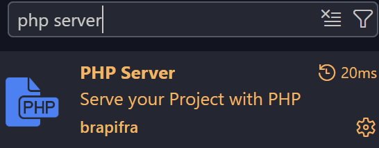
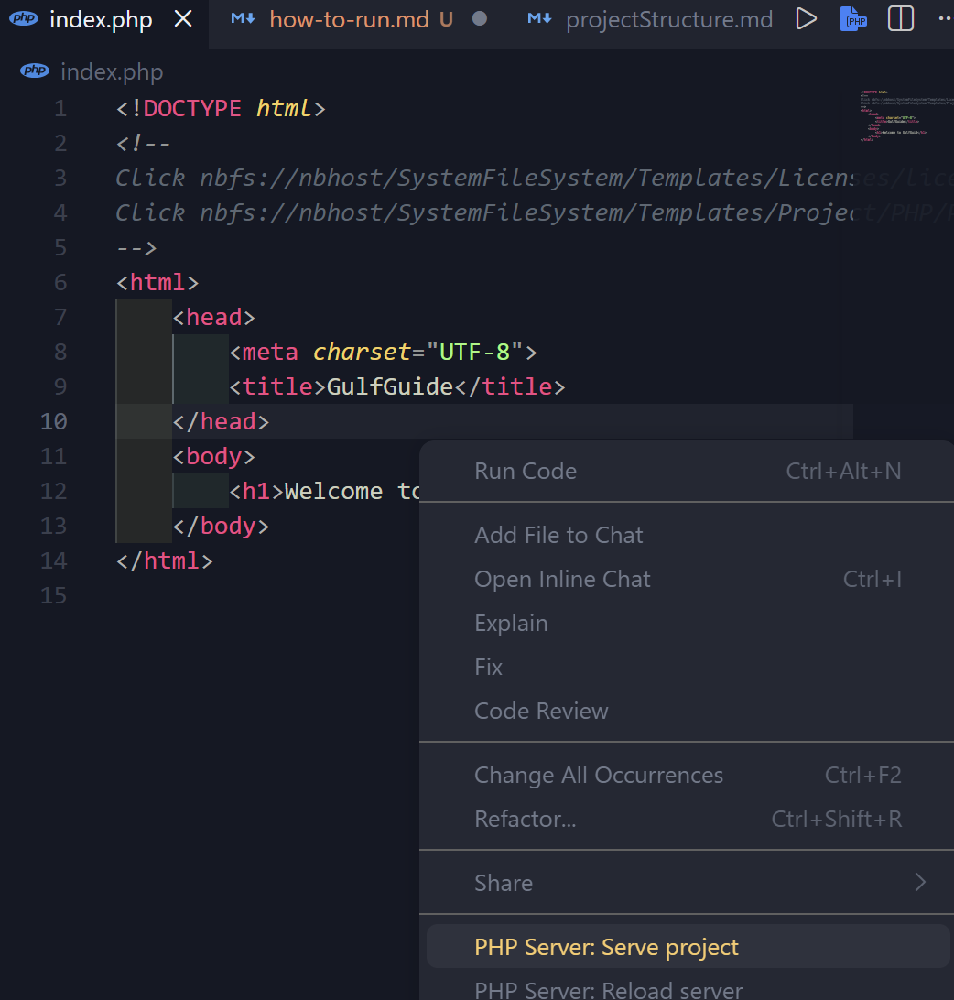
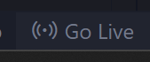
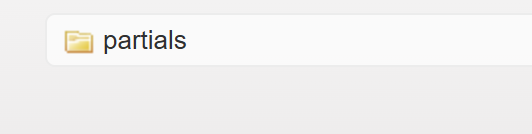

# how to run and test the project (as of for now at least)

> im using **vs code** instead of netbeans. netbeans didn't workout for me.  if u figure out a solution to make it work in netbeans pls share it!

### install php server extension

accept/trust the extension when prompted

### right-click the index.php and select `serve project`

## Questions

> I'm currently working on the partials (footer/header) so how can i see my work?

1. install `live server` extension
2. click on this -> in the bottom right corner of vs code.

3. navigate to the file destination ur working on
